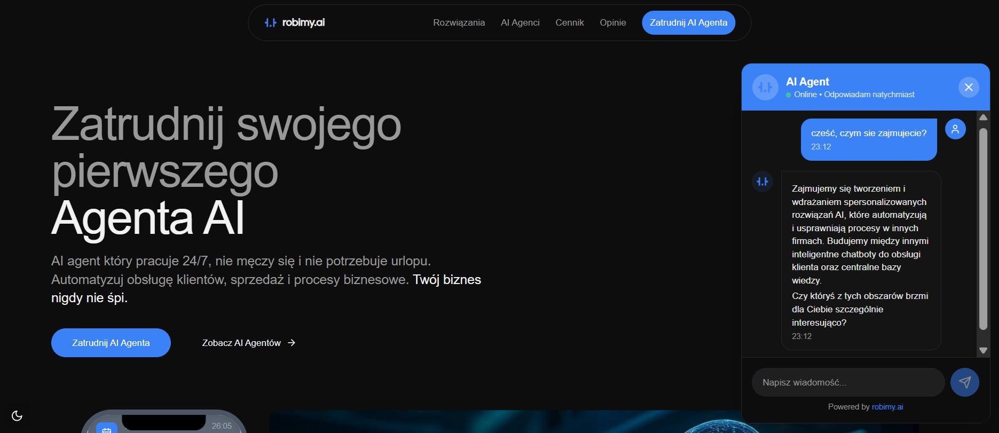
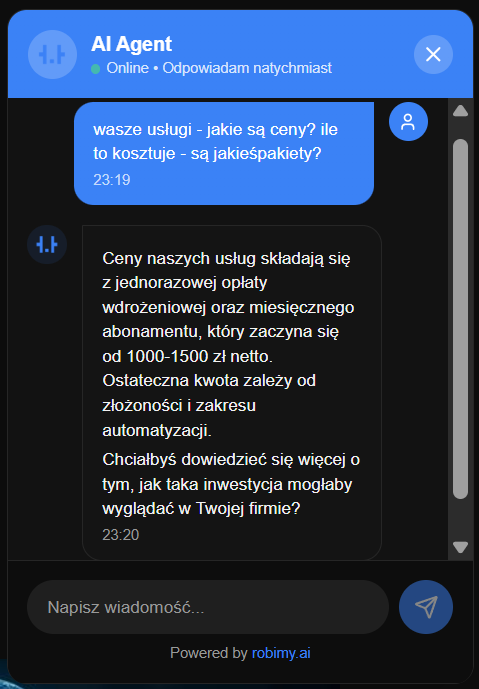
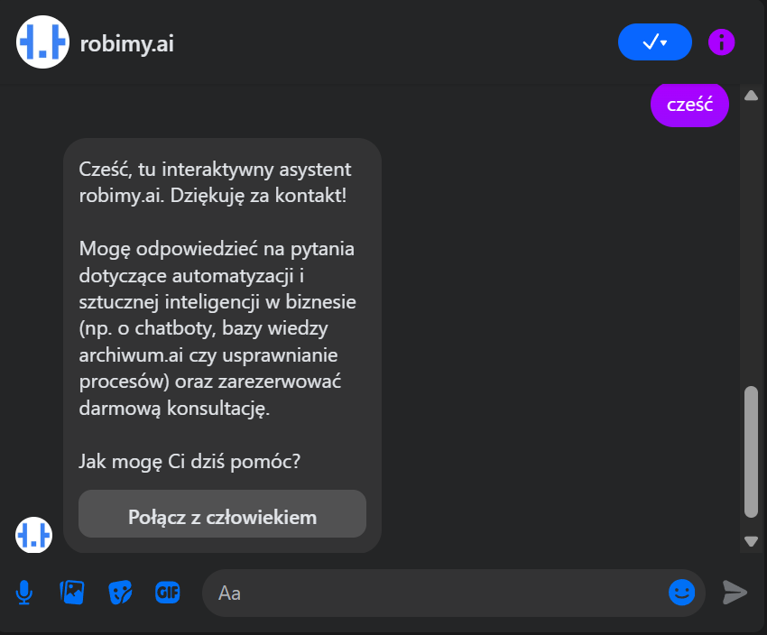
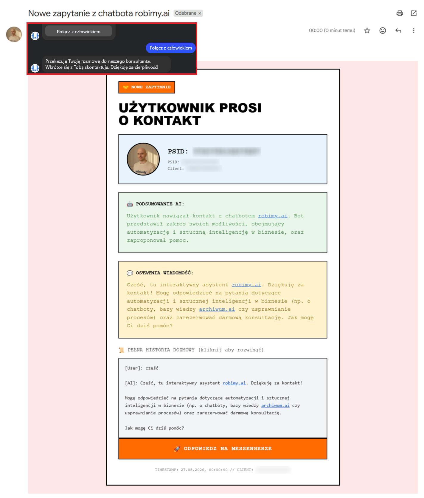
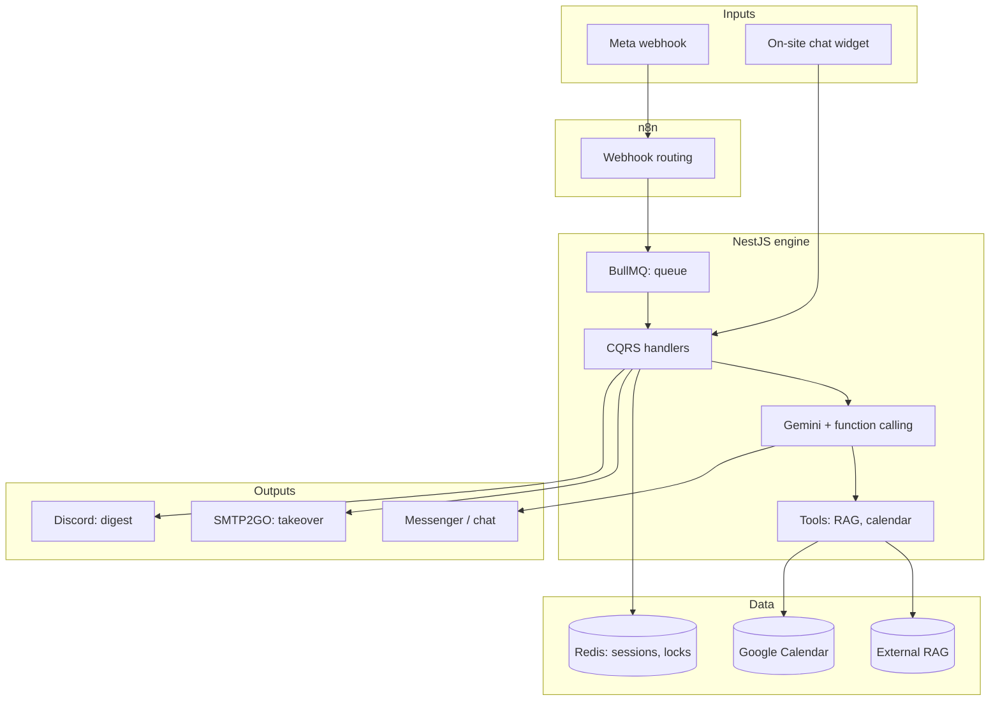

<p align="center"></p>

<h1 align="center">AI Conversation Engine</h1>

<h3 align="center">Handles customers on Messenger and on-site chat: answers from a knowledge base, books meetings and hands the conversation over to the team.</h3>

<p align="center">
  
  
  
  
  
  
</p>

---

## Table of contents

- [About](#about)
- [Screenshots](#screenshots)
- [Source code](#source-code)
- [Stack](#stack)
- [Features](#features)
- [Architecture](#architecture)
- [Statistics](#statistics)
- [My role](#my-role)
- [Contact](#contact)

---

## About

Service businesses get customer inquiries on Messenger and through on-site chat around the clock. Manual handling does not scale: replies wait for hours, leads go cold and the owner has no idea what customers ask about.

The engine takes over the first line of conversations. It answers from the client's knowledge base, suggests calendar slots and detects when a human should step in. One system serves many clients at once: each company has its own configuration, and the engine recognizes where each message comes from.

The system has run in production since December 2025 and serves 11 tenants, including the in-house product robimy.ai. It merges message bursts, adapts language to the customer's profile, sends meeting reminders and a daily AI-classified conversation report.

---

## Screenshots

| Customer writes on the company website | Bot answers from the client's documents |
|:---:|:---:|
|  |  |

| Messenger welcome | Team gets a conversation summary |
|:---:|:---:|
|  |  |

> **Note:** the widget shots show a fictional conversation with the bot on the production site. The Messenger shots come from a test session. The e-mail shot shows a real takeover notification: conversation transcript, AI summary and session metadata.

---

## Source code

The code is private and confidential (a commercial product and a client system). This repo documents the project: description, architecture and screenshots of it in action.

---

## Stack

### Engine (Node 22)

```
NestJS 11 + CQRS              // modules per domain, command handlers
BullMQ + Redis                // webhook queue, sessions, locks, dedup
Gemini 2.5 Pro per tenant     // function calling, max 5 steps
Gemini Flash-Lite             // summaries, translations, language detection
```

### AI tools

```
RAG (external HTTP service)   // client knowledge base, per-tenant key
Google Calendar API           // availability, booking, rescheduling
Playwright + stealth          // Messenger profile scraper (GraphQL)
```

### Integrations and operations

```
n8n                           // Meta webhook routing to the engine
SMTP2GO                       // human takeover + error alerts
Discord webhook               // daily conversation digest
Docker Compose on a VPS       // engine + Redis, healthcheck, AOF
```

---

## Features

### Messenger

- **Source-aware welcome** - ad traffic goes straight into the conversation, organic traffic gets a button to reach a human. Fewer barriers for campaign leads
- **Merging message bursts** - several short messages in a minute count as one turn. The AI does not reply after every word
- **Spam protection** - one active conversation turn at a time, timed locks and session reset. Stable handling under heavy traffic
- **Language from the customer's profile** - the system detects language and translates the welcome and replies. Customers write in their own language

### Post comments

- **Public reply and a private conversation** - a short public reply under the post, then a private message sequence with a greeting, an answer and a contact invitation
- **Natural delay** - the reply does not land instantly. We avoid the feel of an obvious bot

### Booking and reminders

- **Three calendar modes** - full booking, availability view only or a booking link inside the conversation. Fits each company's policy
- **Meeting reminders** - a message one day and one hour before. Fewer no-shows
- **Return to a silent conversation** - after two days without contact the system sends a calendar link. The lead does not disappear

### Human takeover

- **Button or signal in the conversation** - the AI stops replying and the conversation waits for a human
- **Email to the team** - profile photo, a short summary and full history. The customer gets a confirmation

### Customer profile

- **Messenger data on first contact** - name, interests and activity from the profile enrich the welcome. The conversation sounds more personal
- **One language for the whole session** - the profile sets the conversation language from the first message

### Monitoring

- **Daily conversation report** - every conversation of the day gets a status: success, drop-off, error or human takeover. The report goes to the operations team
- **Error alerts** - email notification with a frequency cap. The team learns about outages without spam
- **Many companies in one engine** - each client has its own configuration and recognition by inbound channel

---

## Architecture



---

## Statistics

### Technical complexity

| Metric | Value |
|---|---|
| **Commits** | 62 (2025-12 - 2026-08) |
| **Lines of code** | 11,641 TypeScript (119 files) |
| **HTTP endpoints** | 18 |
| **Domain modules** | 17 (engine, calendar, scraper, digest, RAG, ...) |
| **BullMQ queues** | 1 (3 attempts, backoff) |
| **Cron jobs** | 4 (reminders, follow-up, digest, RAG report) |
| **Production tenants** | 11 |
| **Gemini models** | 3 (Pro per tenant + 2x Flash-Lite) |

### Feature overview

| Category | Highlights |
|---|---|
| **Messenger** | ad vs organic welcome, message merging, language from profile |
| **Comments** | public reply and private conversation |
| **Booking** | meeting scheduling and reminders |
| **Human takeover** | in-conversation button, email to the team |
| **Customer profile** | personalized welcome and session language |
| **Monitoring** | daily conversation report and error alerts |

---

## My role

The n8n prototype and all of the current engine code are mine. [Alan Cesarski](https://github.com/acesarski) historically ported the prototype from n8n to the first code version; I write and maintain the current engine on my own.

---

## Contact

| Platform | Link |
|---|---|
| **WWW** | [kamilkaczmareksolutions.com](https://kamilkaczmareksolutions.com) |
| **GitHub** | [kamilkaczmareksolutions](https://github.com/kamilkaczmareksolutions) |
| **LinkedIn** | [Kamil Kaczmarek](https://www.linkedin.com/in/kamilkaczmareksolutions) |
| **Email** | [recruitment@kamilkaczmareksolutions.com](mailto:recruitment@kamilkaczmareksolutions.com) |

---

**AI Conversation Engine** - a first line of customer conversations that never sleeps.

<p align="center"><em>Built by Kamil Kaczmarek</em></p>
