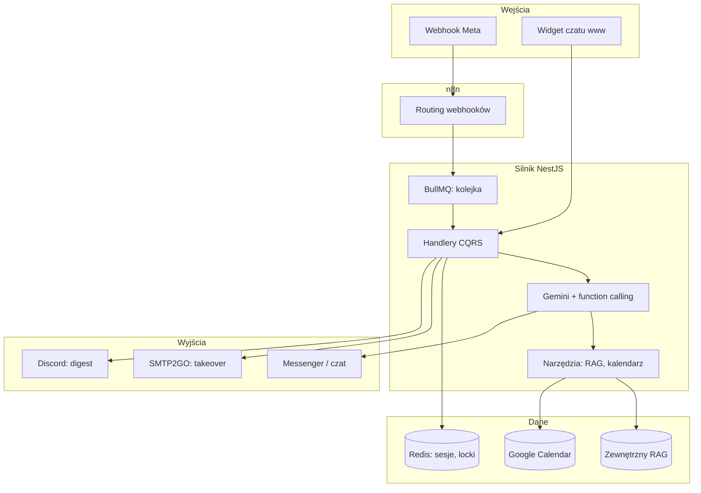

<p align="center"></p>

<h1 align="center">Silnik Konwersacyjny AI</h1>

<h3 align="center">Obsługuje klientów na Messengerze i czacie www: odpowiada z bazy wiedzy, umawia spotkania i przekazuje rozmowę do zespołu.</h3>

<p align="center">
  
  
  
  
  
  
</p>

---

## Spis treści

- [O projekcie](#o-projekcie)
- [Screenshoty](#screenshoty)
- [Kod źródłowy](#kod-źródłowy)
- [Stack](#stack)
- [Funkcje](#funkcje)
- [Architektura](#architektura)
- [Statystyki](#statystyki)
- [Moja rola](#moja-rola)
- [Kontakt](#kontakt)

---

## O projekcie

Firmy usługowe dostają zapytania od klientów na Messengerze i przez czat na stronie o każdej porze. Ręczna obsługa nie skaluje się: odpowiedzi czekają godzinami, leady stygną, a właściciel nie wie, o co pytają klienci.

Silnik przejmuje pierwszą linię rozmów. Odpowiada z bazy wiedzy klienta, proponuje terminy w kalendarzu i wykrywa moment, kiedy rozmowę powinien przejąć człowiek. Jeden system obsługuje wielu klientów naraz: każda firma ma własną konfigurację, a silnik rozpoznaje źródło wiadomości.

System działa na produkcji od grudnia 2025 i obsługuje 11 tenantów, w tym własny produkt robimy.ai. Skleja wiadomości pisane seriami, dostosowuje język do profilu klienta, wysyła przypomnienia o spotkaniach i codzienny raport rozmów klasyfikowany przez AI.

---

## Screenshoty

| Klient pisze na stronie firmy | Bot odpowiada z dokumentów klienta |
|:---:|:---:|
|  |  |

| Powitanie na Messengerze | Zespół dostaje podsumowanie rozmowy |
|:---:|:---:|
|  |  |

> **Nota:** kadry z widgetu pokazują fikcyjną rozmowę z botem na produkcyjnej stronie. Kadry z Messengera pochodzą z sesji testowej. Kadr e-maila pokazuje prawdziwe powiadomienie o przejęciu rozmowy: transkrypcję, podsumowanie AI i dane techniczne sesji.

---

## Kod źródłowy

Kod jest prywatny i poufny (produkt komercyjny i system klientów). To repo dokumentuje projekt: opis, architekturę i zrzuty działania.

---

## Stack

### Silnik (Node 22)

```
NestJS 11 + CQRS              // moduły per domena, handlery komend
BullMQ + Redis                // kolejka webhooków, sesje, locki, dedup
Gemini 2.5 Pro per tenant     // function calling, max 5 kroków
Gemini Flash-Lite             // streszczenia, tłumaczenia, detekcja języka
```

### Narzędzia AI

```
RAG (zewnętrzny serwis HTTP)  // baza wiedzy klienta, klucz per tenant
Google Calendar API           // dostępność, rezerwacja, zmiana terminu
Playwright + stealth          // scraper profilu Messenger (GraphQL)
```

### Integracje i operacje

```
n8n                           // routing webhooków Meta do silnika
SMTP2GO                       // human takeover + alerty błędów
Discord webhook               // dzienny digest konwersacji
Docker Compose na VPS         // engine + Redis, healthcheck, AOF
```

---

## Funkcje

### Messenger

- **Powitanie zależne od źródła** - klient z reklamy trafia od razu do rozmowy, organiczny dostaje przycisk kontaktu z człowiekiem. Mniej barier dla leadów z kampanii
- **Łączenie wiadomości pisanych seriami** - kilka krótkich wiadomości w minutę traktujemy jak jedną wypowiedź. AI nie odpowiada po każdym słowie
- **Ochrona przed spamem** - jedna aktywna tura rozmowy naraz, czasowe blokady i reset sesji. Stabilna obsługa przy dużym ruchu
- **Język z profilu klienta** - system wykrywa język i tłumaczy powitanie oraz odpowiedzi. Klient pisze po swojemu

### Komentarze pod postami

- **Odpowiedź publiczna i rozmowa na priv** - pod postem krótka odpowiedź, potem sekwencja wiadomości prywatnych z powitanem, odpowiedzią i zaproszeniem do kontaktu
- **Naturalne opóźnienie** - odpowiedź nie pada natychmiast. Unikamy wrażenia automatu

### Rezerwacje i przypomnienia

- **Trzy warianty kalendarza** - pełne umawianie, sam podgląd wolnych terminów albo link do zapisu w treści rozmowy. Dopasowanie do polityki firmy
- **Przypomnienia przed spotkaniem** - wiadomość dzień i godzinę przed. Mniej nieobecności
- **Powrót do cichej rozmowy** - po dwóch dniach bez kontaktu system wysyła link do kalendarza. Lead nie ginie

### Przejęcie przez człowieka

- **Przycisk lub sygnał w rozmowie** - AI przestaje odpowiadać, rozmowa czeka na człowieka
- **Mail do zespołu** - zdjęcie profilu, krótkie podsumowanie i pełna historia. Klient dostaje potwierdzenie

### Profil klienta

- **Dane z Messengera przy pierwszym kontakcie** - imię, zainteresowania i aktywność z profilu wzmacniają powitanie. Rozmowa brzmi osobiściej
- **Jeden język na całą sesję** - profil ustawia język rozmowy od pierwszej wiadomości

### Monitoring

- **Dzienny raport rozmów** - każda rozmowa dnia dostaje status: sukces, porzucenie, błąd lub przejęcie. Raport trafia do zespołu operacyjnego
- **Alerty błędów** - powiadomienie mailowe z limitem częstotliwości. Zespół wie o awarii bez spamu
- **Wiele firm w jednym silniku** - każdy klient ma własną konfigurację i rozpoznawanie po kanałach wejściowych

---

## Architektura



---

## Statystyki

### Złożoność techniczna

| Metryka | Wartość |
|---|---|
| **Commity** | 62 (2025-12 - 2026-08) |
| **Linie kodu** | 11 641 TypeScript (119 plików) |
| **Endpointy HTTP** | 18 |
| **Moduły domenowe** | 17 (engine, kalendarz, scraper, digest, RAG, ...) |
| **Kolejki BullMQ** | 1 (3 próby, backoff) |
| **Zadania cron** | 4 (przypomnienia, follow-up, digest, raport RAG) |
| **Tenantów na produkcji** | 11 |
| **Modele Gemini** | 3 (Pro per tenant + 2x Flash-Lite) |

### Przegląd funkcji

| Kategoria | Najważniejsze |
|---|---|
| **Messenger** | powitanie z reklamy i organicznego, łączenie wiadomości, język z profilu |
| **Komentarze** | odpowiedź publiczna i rozmowa na priv |
| **Rezerwacje** | umawianie spotkań i przypomnienia |
| **Przejęcie przez człowieka** | przycisk w rozmowie, mail do zespołu |
| **Profil klienta** | personalizacja powitania i język sesji |
| **Monitoring** | dzienny raport rozmów i alerty błędów |

---

## Moja rola

Prototyp w n8n i cały obecny kod silnika są moje. [Alan Cesarski](https://github.com/acesarski) historycznie przeniósł prototyp z n8n na pierwszą wersję kodu; obecny silnik piszę i utrzymuję sam.

---

## Kontakt

| Platforma | Link |
|---|---|
| **WWW** | [kamilkaczmareksolutions.com](https://kamilkaczmareksolutions.com) |
| **GitHub** | [kamilkaczmareksolutions](https://github.com/kamilkaczmareksolutions) |
| **LinkedIn** | [Kamil Kaczmarek](https://www.linkedin.com/in/kamilkaczmareksolutions) |
| **Email** | [recruitment@kamilkaczmareksolutions.com](mailto:recruitment@kamilkaczmareksolutions.com) |

---

**Silnik Konwersacyjny AI** - pierwsza linia rozmów z klientami, która nigdy nie śpi.

<p align="center"><em>Zbudował Kamil Kaczmarek</em></p>
